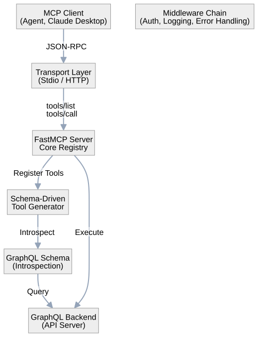
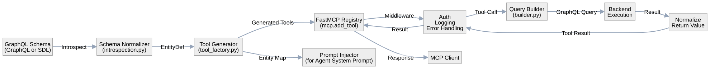
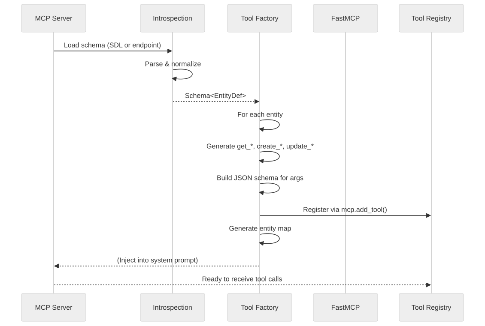
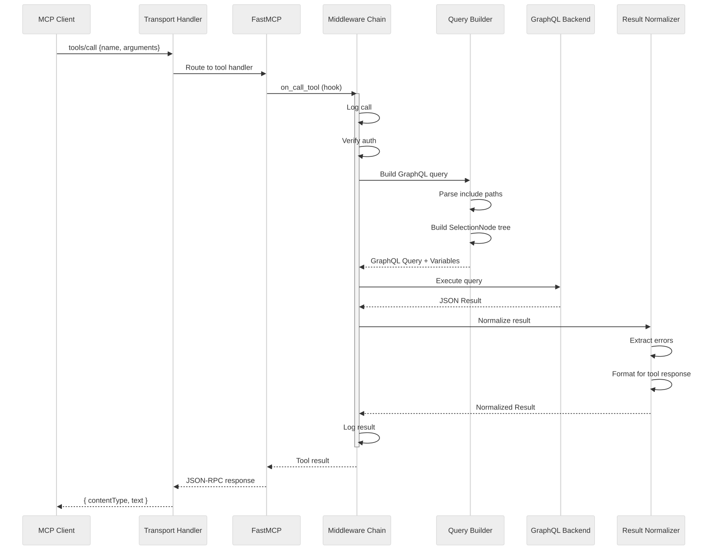
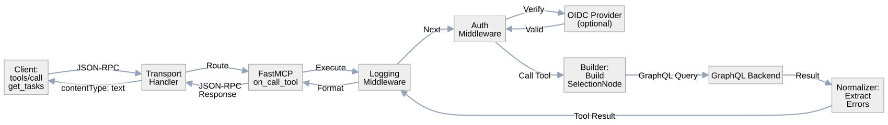

# MCP Server Architecture

A production-shaped Model Context Protocol (MCP) server with tools **auto-generated from a GraphQL schema** instead of hand-written one at a time.

## System Overview



## Logical Architecture



## Tool Generation Pipeline



## Tool Call Execution Flow



## Component Details

### Transport Layer

**Two implementations, same tool registry**:

1. **Stdio Transport** (default)
   - File: `server.py` - `create_mcp()` returns FastMCP instance
   - FastMCP handles JSON-RPC over stdin/stdout
   - No auth concept (caller already authenticated to parent process)
   - Best for: Claude Desktop, local agent testing

2. **HTTP Transport** (server-hosted)
   - File: `server.py` - `build_asgi_app()` wraps FastMCP in Starlette
   - Endpoints: `POST /mcp/tools/list`, `POST /mcp/tools/call`
   - Auth middleware validates Bearer token
   - Best for: Remote agents, multiple clients

**Key**: Transport is a thin adapter. All logic (tools, middleware, execution) is transport-agnostic inside `FastMCP`.

### Schema Introspection

- **File**: `graphql/introspection.py`
- **Input**: GraphQL schema (SDL string or fetched from `GRAPHQL_SCHEMA_ENDPOINT`)
- **Output**: `SchemaIntrospection` - normalized internal representation
- **Normalizes**:
  - Scalar fields (name, type, description, mutability)
  - Nested relations (depth 1: direct related entities accessible via dot-notation)
  - Query shapes: `is_list` (array return) vs single object
  - Create/update mutations vs read-only entities

**Critical**: `is_list` must thread through to generated tool JSON schema. A single-object query that declares array output causes validation failures downstream.

### Tool Factory

- **File**: `registry/tool_factory.py`
- **Process**:
  1. Iterate over each entity in normalized schema
  2. Generate `get_<entity>` tool (read-only)
  3. Generate `create_<entity>` tool (if mutation exists)
  4. Generate `update_<entity>` tool (if mutation exists)
  5. Each tool gets auto-generated description from schema docs
  6. JSON schema built from entity fields + nested relations
  7. Register via `mcp.add_tool()`

- **Overrides**: 
  - `definitions/overrides.json` - Hide query, override description, exclude field from mutations
  - Overrides are escape hatch, not primary mechanism
  - If reaching for them constantly, generator needs fixing

### Include Paths (Nested Relations)

- **File**: `graphql/builder.py`
- **Concept**: Fetch related entities via dot-notation instead of eager-loading everything
  - Example: `include=["tasks.assignee"]` - fetch tasks with their assignees
  - Allows tools to be lightweight while still queryable for relations
  - Built via `SelectionNode` tree in GraphQL execution

### Entity Map

- **File**: `registry/entity_map.py`, exposed as the `resource://entity-map` MCP
  resource (`server.py`'s `_register_entity_map_resource`)
- **Purpose**: Compact summary of all queryable entities + fields, generated
  from the same schema as the tools themselves
  - A client can fetch this before calling tools, so it knows what fields
    exist up front — whether that fetched text ends up in a system prompt,
    a tool description, or somewhere else is up to the client; this server
    only makes it available, it doesn't inject anything into anyone's prompt
  - Prevents the fetch-then-refetch pattern (the problem this solves) for
    any client that actually reads it before calling `get_*` tools
  - Rendered from same normalized schema as tool factory (never drift)
  - Example injection:
    ```
    Project fields: id, name, description, tasks (nested)
    Task fields: id, title, status, project, assignee (nested)
    ```

### Middleware Chain

Each middleware wraps tool calls independently (FastMCP's `on_call_tool` hook):

1. **Logging Middleware**
   - Logs tool name, arguments, result, latency
   - No auth check (transport handles that)

2. **Error Handling Middleware**
   - Catches exceptions from tool execution
   - Normalizes errors into tool response format
   - Prevents a single bad tool from killing the connection

3. **Auth Middleware** (HTTP only)
   - Extracts Bearer token from request header
   - Delegates to pluggable `AuthProvider`
   - Returns 401 if invalid
   - Forwards identity context to tool execution

### Authentication

**Pluggable interface** (`AuthProvider` protocol):

```python
class AuthProvider(Protocol):
    async def validate_token(self, token: str) -> AuthContext:
        """Verify token and return caller context"""
        ...
```

**Implementations**:

1. **No Auth** (default)
   - Useful for development, trusted backends

2. **Static Token** (testing)
   - Environment variable `DEV_TOKEN`
   - Simple string comparison, nothing fancy
   - For local testing without real OIDC provider

3. **OIDC** (production)
   - File: `auth/jwt_validator.py`
   - Fetches JWKS from provider
   - Validates JWT signature + audience claim
   - Provider-agnostic (Keycloak, Azure AD, Auth0, Cognito)

### Configuration

Environment variables:

| Variable | Purpose | Example |
|----------|---------|---------|
| `GRAPHQL_BASE_URL` | Backend GraphQL endpoint | `https://api.example.com` |
| `GRAPHQL_SCHEMA_FILE` | Path to cached schema SDL | `./demo-schema.graphql` |
| `GRAPHQL_API_TOKEN` | Bearer token for backend | (static token) |
| `GRAPHQL_VERIFY_SSL` | Verify HTTPS certificates | `true` |
| `MCP_TRANSPORT` | Transport type | `stdio` (default) or `http` |
| `HOST` | HTTP bind address | `0.0.0.0` |
| `PORT` | HTTP listen port | `3001` |
| `MOCK_BACKEND` | Auto-start mock GraphQL server | `1` for testing |
| `DEV_TOKEN` | Static token for auth testing | (any string) |
| `OIDC_DISCOVERY_URL` | OIDC provider discovery endpoint | `https://.../.well-known/openid-configuration` |
| `OIDC_AUDIENCE` | Expected JWT audience claim | `my-api` |
| `OIDC_JWKS_URI` | Direct JWKS endpoint (alt to discovery) | `https://.../jwks.json` |

### Mock Backend

- **File**: `mock_backend/` - Strawberry GraphQL server
- **Purpose**: Full MCP server stack without real backend (for testing)
- **Schema**: Mirrors `demo-schema.graphql` with fixture data
- **Launch**: Auto-start via `MOCK_BACKEND=1` or manual in separate terminal
- **Mutations**: In-memory state (survives while running, resets on restart)

## Data Flow: Complete Tool Call



## Design Decisions

1. **Schema-Driven Generation** - Introspect once at startup, generate all tools. No hand-written tool registrations for the standard CRUD pattern.

2. **Transport Abstraction** - Both stdio and HTTP speak to the same FastMCP instance. Transport is a thin I/O adapter, not where logic lives.

3. **Pluggable Auth** - No concrete auth implementation tied to a specific provider. Interface is provider-agnostic, OIDC validator included.

4. **Middleware Composition** - Each concern (logging, auth, error handling) is independent middleware. Easy to add/remove/reorder.

5. **Overrides as Escape Hatch** - Generator covers 90% of use cases. Overrides file for the 10% the generator can't fully infer.

6. **Entity Map Injection** - Agent gets a system prompt hint about what fields exist, avoiding fetch-then-refetch. Map is generated from the same schema as tools (no drift).

## Known Pitfalls (Production Incidents)

1. **Single-object query declaring array output**
   - If `is_list` is lost downstream, every tool output shape is wrong
   - Validation fails for single-object queries
   - Fix: Thread `is_list` end-to-end, test single-object query specifically

2. **Guard query silently stops guarding**
   - If authorization query is raw string + error is swallowed, guard breaks
   - Fix: Use typed queries for security, never swallow auth check exceptions

3. **Schema field the generator can't handle**
   - Don't force every query through generator. Use overrides to skip:
     - Input types that don't fit create/update pattern
     - Object-only queries with no filter support
   - Fix: Add override, let generator skip gracefully

## Testing Strategy

1. **Inspect generated tools** before running server
   ```powershell
   python -m mcp_server_template generate --schema-file demo-schema.graphql --json
   ```

2. **Mock backend** - Full stack without real API
   ```powershell
   MOCK_BACKEND=1 python -m mcp_server_template
   ```

3. **stdio transport** - Test with MCP client library

4. **HTTP transport** - Test with curl
   ```powershell
   curl -X POST http://localhost:3001/mcp/tools/list \
     -H "Content-Type: application/json" \
     -H "Authorization: Bearer token" \
     -d '{}'
   ```

## Deployment

- **Container**: Docker image with Python 3.10+, FastMCP, uvicorn
- **Execution**: Single async process
- **Scaling**: Stateless (schema cached, tools generated once at startup)
- **Observability**: Structured logging (stderr for JSON-RPC over stdout stays clean)

## Related Documentation

- `CLAUDE.md` - Implementation details and working conventions
- `TASKS.md` - Build task breakdown (gitignored)
- `README.md` - User-facing pitch and quick start
- `demo-schema.graphql` - Example domain (project/task/member entities)


